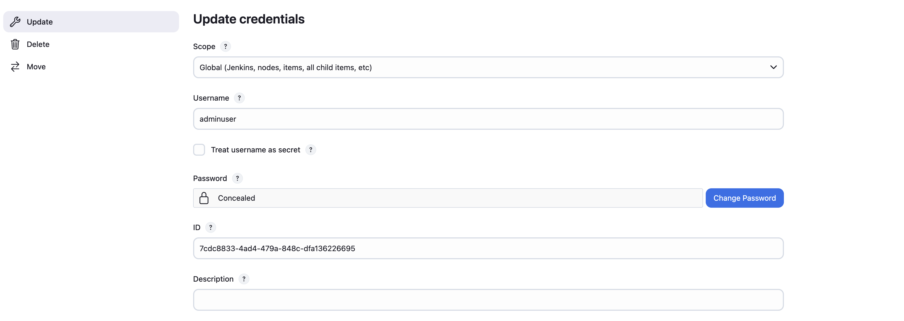
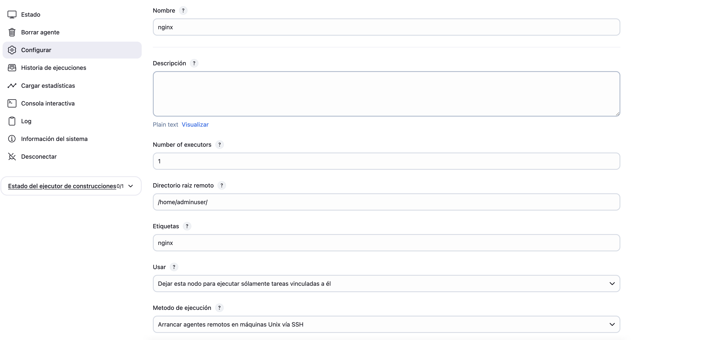
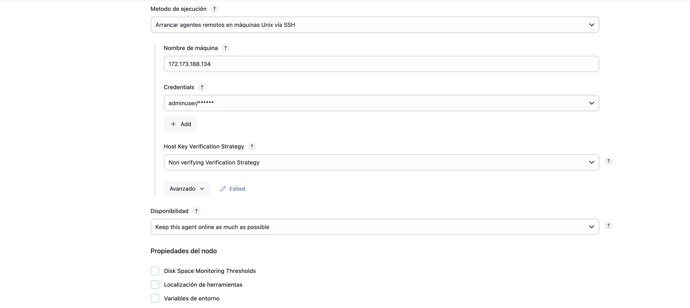
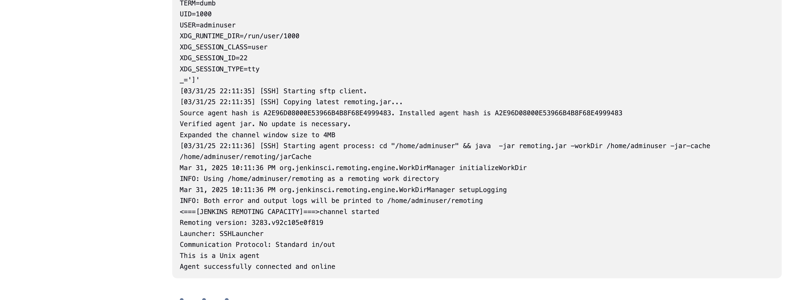
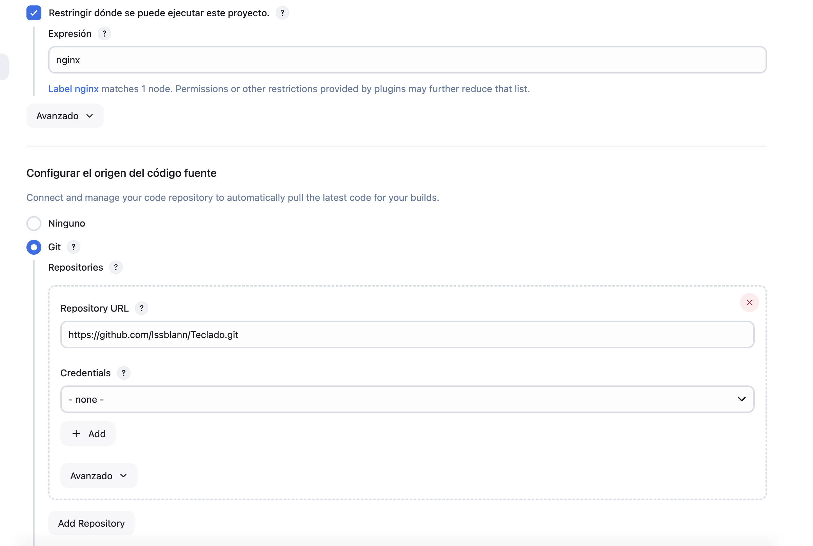
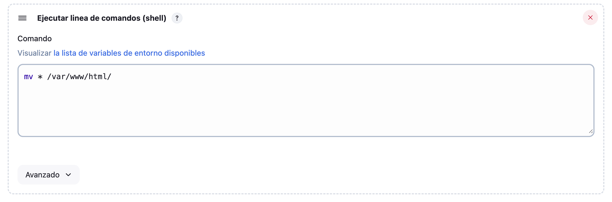
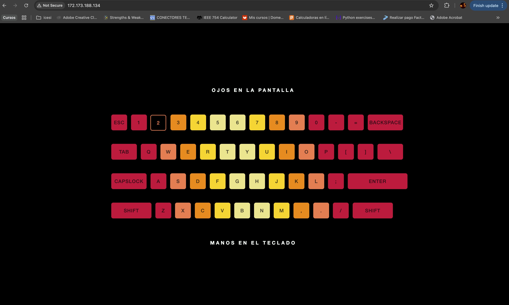

# ansible-pipeline
ADDED: ansible.cfg to use the password, added inventory.ini to add the hosts, created the file plugins.txt, as it is needed in playbook.yml
    Added open jdk 17 to nginx so jenkins agent can run, added images for the readme
CHANGED: jenkins and sonar version to latest
ERROR: the playbook needs to be ran twice, as we add the user to the docker group but this change wont be applied until we log out and log back in

# Deploying js app using Jenkins
First in the invertory.ini you need to have both machines with their ip address, and the ssh user and password, so ansible knows where to install what, also you need the ansible.cfg with the host key checking of so you don't run into some problems.
As said above, you might have to run this playbook twice, as we add the user to the docker group but this change wont be applied until we log out and log back in

After you've successfully ran this playbook, now you need to configure jenkins so that it builds the js app in the nginx machine
## Requirements
YOU NEED TO ADD THE FOLLOWING PLUGINS:
    SSH Build Agents plugin to add the agent in jenkins
    GitHub plugin to clone and use the repo

## Configure Jenkins
First, add credentials to jenkins, I find rsa keys to be annoying, so I prefer to use user and password, it should look something like this

   

Where you replace adminuser with the ssh user and add the password

Now, lets configure the agent: fill out the configuration with whatever you like, HOWEVER be sure to add a label (etiqueta) so that we can later use it in the task

Also, in the name of the host, add the ip address

Now, launch the agent and make sure it is running, remember, jenkins agents NEEDS java to run, so make sure it is installed in the agent machine
The running machine log should look like this

if you're having trouble connecting to the agent (so help you god), you can check the logs, also make sure the ssh keys (if you're using them) are correct, and that the user has access to the agent machine, good luck

## task time

Now, we create the task/job

give it a name and make sure to restrict where the project can be run, this is important, as we will be using the label to restrict the task to run only in the agent machine, add the same label/etiqueta you added to the agent

Also, add the git repo url, remember the default branch is master, you might have to change it to main if you're using that branch

The rest is simple, basically jenkins will clone the repo and what we want to do is copy the files and move them to the default nginx directory, so we need to add a shell script to do that, it's simple

now, run the task and check the logs, you might have to debug some stuff as jenkins is allergic to working on the first go.

Once you got it running go into the nginx machine port 8080 and (if you used the same repo as me) you should see the following app running  

Having said this, good luck and happy coding, remember, jenkins might be stubborn but so are you, crash out and try again. 